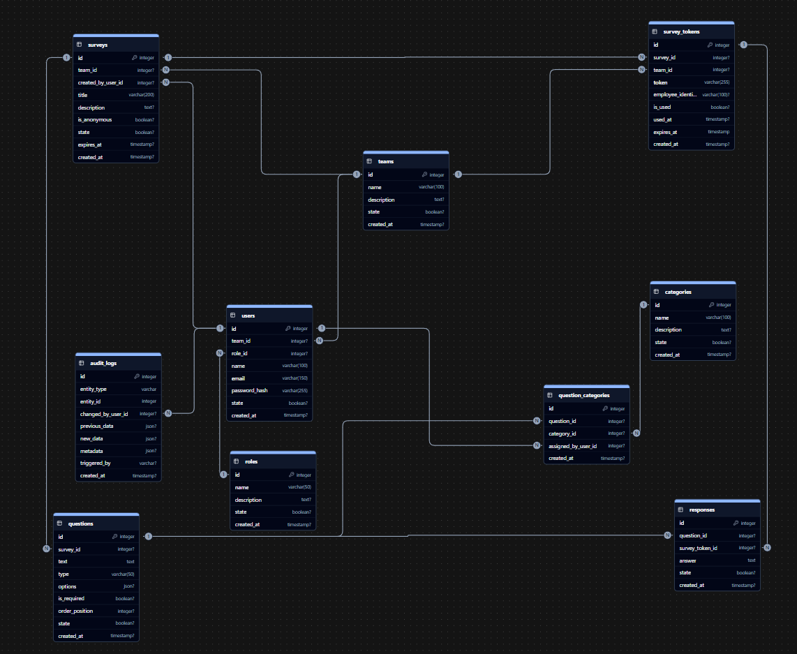

# Prototipo del esquema de la base de datos

```sql
-- Teams table
CREATE TABLE teams (
    id SERIAL PRIMARY KEY,
    name VARCHAR(100) NOT NULL,
    description TEXT,
    state BOOLEAN DEFAULT TRUE,
    created_at TIMESTAMP DEFAULT CURRENT_TIMESTAMP
);

-- Roles table
CREATE TABLE roles (
    id SERIAL PRIMARY KEY,
    name VARCHAR(50) NOT NULL UNIQUE,
    description TEXT,
    state BOOLEAN DEFAULT TRUE,
    created_at TIMESTAMP DEFAULT CURRENT_TIMESTAMP
);

-- Indices in Roles
CREATE INDEX idx_roles_name ON roles(name);
CREATE INDEX idx_roles_state ON roles(state);

-- Users table
CREATE TABLE users (
    id SERIAL PRIMARY KEY,
    team_id INT REFERENCES teams(id) ON DELETE SET NULL,
    role_id INT REFERENCES roles(id) ON DELETE SET NULL,
    name VARCHAR(100) NOT NULL,
    email VARCHAR(150) UNIQUE NOT NULL,
    password_hash VARCHAR(255) NOT NULL,
    state BOOLEAN DEFAULT TRUE,
    created_at TIMESTAMP DEFAULT CURRENT_TIMESTAMP
);

-- Indices in Users
CREATE INDEX idx_users_team_id ON users(team_id);
CREATE INDEX idx_users_role_id ON users(role_id);
CREATE INDEX idx_users_state ON users(state);
CREATE INDEX idx_users_email ON users(email);

-- Surveys table
CREATE TABLE surveys (
    id SERIAL PRIMARY KEY,
    team_id INT REFERENCES teams(id) ON DELETE CASCADE,
    created_by_user_id INT REFERENCES users(id) ON DELETE SET NULL,
    title VARCHAR(200) NOT NULL,
    description TEXT,
    is_anonymous BOOLEAN DEFAULT TRUE,
    state BOOLEAN DEFAULT TRUE,
    expires_at TIMESTAMP,
    created_at TIMESTAMP DEFAULT CURRENT_TIMESTAMP
);

-- Indices in Surveys
CREATE INDEX idx_surveys_team_id ON surveys(team_id);
CREATE INDEX idx_surveys_created_by ON surveys(created_by_user_id);
CREATE INDEX idx_surveys_created_at ON surveys(created_at);
CREATE INDEX idx_surveys_expires_at ON surveys(expires_at);
CREATE INDEX idx_surveys_state ON surveys(state);

-- Survey Tokens table
CREATE TABLE survey_tokens (
    id SERIAL PRIMARY KEY,
    survey_id INT REFERENCES surveys(id) ON DELETE CASCADE,
    team_id INT REFERENCES teams(id) ON DELETE CASCADE,
    token VARCHAR(255) UNIQUE NOT NULL,
    employee_identifier VARCHAR(100), -- Optional: Internal ID without personal data
    is_used BOOLEAN DEFAULT FALSE,
    used_at TIMESTAMP,
    expires_at TIMESTAMP NOT NULL,
    created_at TIMESTAMP DEFAULT CURRENT_TIMESTAMP
);

-- Indices in Survey Tokens
CREATE INDEX idx_survey_tokens_token ON survey_tokens(token);
CREATE INDEX idx_survey_tokens_survey_id ON survey_tokens(survey_id);
CREATE INDEX idx_survey_tokens_team_id ON survey_tokens(team_id);
CREATE INDEX idx_survey_tokens_expires_at ON survey_tokens(expires_at);
CREATE INDEX idx_survey_tokens_is_used ON survey_tokens(is_used);

-- Questions table
CREATE TABLE questions (
    id SERIAL PRIMARY KEY,
    survey_id INT REFERENCES surveys(id) ON DELETE CASCADE,
    text TEXT NOT NULL,
    type VARCHAR(50) NOT NULL,
    options JSON,
    is_required BOOLEAN DEFAULT FALSE,
    order_position INT DEFAULT 0,
    state BOOLEAN DEFAULT TRUE,
    created_at TIMESTAMP DEFAULT CURRENT_TIMESTAMP
);

-- Indices in Questions
CREATE INDEX idx_questions_survey_id ON questions(survey_id);
CREATE INDEX idx_questions_type ON questions(type);
CREATE INDEX idx_questions_order ON questions(order_position);
CREATE INDEX idx_questions_state ON questions(state);

-- Responses table
CREATE TABLE responses (
    id SERIAL PRIMARY KEY,
    question_id INT REFERENCES questions(id) ON DELETE CASCADE,
    survey_token_id INT REFERENCES survey_tokens(id) ON DELETE CASCADE,
    answer TEXT NOT NULL,
    state BOOLEAN DEFAULT TRUE,
    created_at TIMESTAMP DEFAULT CURRENT_TIMESTAMP
);

-- Indices in Responses
CREATE INDEX idx_responses_question_id ON responses(question_id);
CREATE INDEX idx_responses_survey_token_id ON responses(survey_token_id);
CREATE INDEX idx_responses_created_at ON responses(created_at);
CREATE INDEX idx_responses_state ON responses(state);

-- Audit Logs table
CREATE TABLE audit_logs (
    id SERIAL PRIMARY KEY,
    entity_type VARCHAR(100) NOT NULL,
    entity_id INT NOT NULL,
    action VARCHAR(50) NOT NULL CHECK (action IN ('create','update','delete','soft_delete','restore','login','logout','assign_role','generate_tokens')),
    changed_by_user_id INT REFERENCES users(id) ON DELETE SET NULL,
    ip_address VARCHAR(45),
    previous_data JSON,
    new_data JSON,
    metadata JSON,
    triggered_by VARCHAR(20) DEFAULT 'manual' CHECK (triggered_by IN ('manual','system')),
    created_at TIMESTAMP DEFAULT CURRENT_TIMESTAMP
);

-- Indices in Audit Logs
CREATE INDEX idx_audit_entity ON audit_logs(entity_type, entity_id);
CREATE INDEX idx_audit_action ON audit_logs(action);
CREATE INDEX idx_audit_changed_by ON audit_logs(changed_by_user_id);
CREATE INDEX idx_audit_created_at ON audit_logs(created_at);
CREATE INDEX idx_audit_triggered_by ON audit_logs(triggered_by);

-- Categories table
CREATE TABLE categories (
    id SERIAL PRIMARY KEY,
    name VARCHAR(100) NOT NULL UNIQUE,
    description TEXT,
    state BOOLEAN DEFAULT TRUE,
    created_at TIMESTAMP DEFAULT CURRENT_TIMESTAMP
);

-- Indices in Categories
CREATE INDEX idx_categories_name ON categories(name);
CREATE INDEX idx_categories_state ON categories(state);

-- Question Categories table
CREATE TABLE question_categories (
    id SERIAL PRIMARY KEY,
    question_id INT REFERENCES questions(id) ON DELETE CASCADE,
    category_id INT REFERENCES categories(id) ON DELETE CASCADE,
    assigned_by_user_id INT REFERENCES users(id) ON DELETE SET NULL,
    created_at TIMESTAMP DEFAULT CURRENT_TIMESTAMP,
    UNIQUE (question_id, category_id)
);

-- Indices in Question Categories
CREATE INDEX idx_question_categories_question_id ON question_categories(question_id);
CREATE INDEX idx_question_categories_category_id ON question_categories(category_id);
CREATE INDEX idx_question_categories_assigned_by ON question_categories(assigned_by_user_id);
```

---

## Explicación de las tablas

### 1. teams

**Función**: agrupa usuarios administrativos y encuestas por departamento/área.

**Campos**:

- `id (PK)`
- `name`
- `description`
- `state` (TRUE = activo, FALSE = inactivo)
- `created_at`

**Relaciones**:

- 1 equipo tiene muchos usuarios administrativos.
- 1 equipo tiene muchas encuestas.
- 1 equipo tiene muchos tokens de encuesta.

---

### 2. roles

**Función**: define los diferentes roles que pueden tener los usuarios administrativos en el sistema.

**Campos**:

- `id (PK)`
- `name` (único) - Ej: "admin", "rrhh"
- `description`
- `state` (TRUE = activo, FALSE = inactivo)
- `created_at`

**Índices**:

- `idx_roles_name` para búsquedas por nombre de rol.
- `idx_roles_state` para filtrar roles activos/inactivos.

**Relaciones**:

- 1 rol puede ser asignado a muchos usuarios administrativos.

---

### 3. users

**Función**: almacena información solo de usuarios administrativos (RRHH, Administradores) que requieren login.

**Campos**:

- `id (PK)`
- `team_id (FK → teams.id)`
- `role_id (FK → roles.id)`
- `name`
- `email (único)` - Solo para usuarios con login
- `password_hash` - Solo para usuarios con login
- `state` (TRUE = activo, FALSE = inactivo)
- `created_at`

**Índices**:

- `idx_users_team_id` para filtrar por equipo.
- `idx_users_role_id` para filtrar por rol.
- `idx_users_state` para filtrar usuarios activos/inactivos.
- `idx_users_email` para login rápido.

**Relaciones**:

- Pertenece a un equipo.
- Tiene un rol asignado.
- Puede crear muchas encuestas.

---

### 4. surveys

**Función**: representa encuestas creadas por usuarios administrativos para un equipo específico.

**Campos**:

- `id (PK)`
- `team_id (FK → teams.id)` - Equipo objetivo de la encuesta
- `created_by_user_id (FK → users.id)` - Usuario admin que creó la encuesta
- `title`
- `description`
- `is_anonymous` (`TRUE` = garantiza anonimato total)
- `state` (TRUE = activo, FALSE = inactivo)
- `expires_at` - Fecha límite para responder
- `created_at`

**Índices**:

- `idx_surveys_team_id` para listar encuestas de un equipo.
- `idx_surveys_created_by` para auditoría de quién creó qué.
- `idx_surveys_created_at` para ordenar o filtrar por fecha.
- `idx_surveys_expires_at` para limpiar encuestas vencidas.
- `idx_surveys_state` para filtrar encuestas activas/inactivas.

**Relaciones:**

- Pertenece a un equipo.
- Fue creada por un usuario administrativo.
- Tiene muchas preguntas.
- Tiene muchos tokens de acceso.

---

### 5. survey_tokens

**Función**: gestiona tokens únicos para acceso anónimo de empleados a encuestas específicas.

**Campos**:

- `id (PK)`
- `survey_id (FK → surveys.id)` - Encuesta asociada
- `team_id (FK → teams.id)` - Equipo del empleado (para métricas)
- `token` (único) - Token UUID para acceso anónimo
- `employee_identifier` - ID interno opcional (ej: "EMP001") sin datos personales
- `is_used` - Si el token ya fue utilizado
- `used_at` - Timestamp de cuándo se usó
- `expires_at` - Fecha de expiración del token
- `created_at`

**Índices**:

- `idx_survey_tokens_token` para validación rápida de tokens.
- `idx_survey_tokens_survey_id` para listar tokens de una encuesta.
- `idx_survey_tokens_team_id` para métricas por equipo.
- `idx_survey_tokens_expires_at` para limpiar tokens vencidos.
- `idx_survey_tokens_is_used` para estadísticas de participación.

**Relaciones**:

- Pertenece a una encuesta específica.
- Asociado a un equipo (para métricas agregadas).
- Tiene muchas respuestas (una vez usado).

**Nota**: Este es el mecanismo clave para el anonimato. No contiene datos personales identificables.

---

### 6. questions

**Función**: define las preguntas dentro de cada encuesta.

**Campos**:

- `id (PK)`
- `survey_id (FK → surveys.id)`
- `text` (contenido de la pregunta)
- `type` (`text`, `multiple_choice`, `rating`)
- `options` (`JSONB`, solo útil en opción múltiple)
- `is_required` - Si la pregunta es obligatoria
- `order_position` - Orden de aparición en la encuesta
- `state` (TRUE = activo, FALSE = inactivo)
- `created_at`

**Índices**:

- `idx_questions_survey_id` para obtener preguntas de una encuesta.
- `idx_questions_type` para filtros por tipo.
- `idx_questions_order` para ordenar preguntas correctamente.
- `idx_questions_state` para filtrar preguntas activas/inactivas.

**Relaciones**:

- Pertenece a una encuesta.
- Tiene muchas respuestas.

---

### 7. responses

**Función**: almacena respuestas completamente anónimas vinculadas a tokens únicos.

**Campos**:

- `id (PK)`
- `question_id (FK → questions.id)`
- `survey_token_id (FK → survey_tokens.id)` - Vincula respuesta al token
- `answer` (texto, valor numérico o selección)
- `state` (TRUE = activo, FALSE = inactivo)
- `created_at`

**Índices**:

- `idx_responses_question_id` para obtener respuestas por pregunta.
- `idx_responses_survey_token_id` para agrupar respuestas de un mismo token.
- `idx_responses_created_at` para análisis temporal.
- `idx_responses_state` para filtrar respuestas activas/inactivas.

**Relaciones**:

- Pertenece a una pregunta.
- Vinculada a un token de encuesta.

**Nota**: El anonimato se garantiza porque:

1. No hay FK directa a usuarios.
2. Solo se vincula al token, que no contiene datos personales.
3. Múltiples tokens pueden pertenecer al mismo equipo sin identificar individuos.

---

### 8. audit_logs

**Función**: registra eventos y cambios del sistema con trazabilidad, sin comprometer el anonimato de empleados.

**Campos**:

- `id (PK)`
- `entity_type` - Tipo de entidad afectada (ej: `survey`, `question`, `response`, `role`, `team`, `user`)
- `entity_id` - ID del registro afectado en su tabla correspondiente
- `action` - Tipo de acción (`create`, `update`, `delete`, `soft_delete`, `restore`, `login`, `logout`, `assign_role`, `generate_tokens`)
- `changed_by_user_id (FK → users.id)` - Usuario admin que realizó la acción
- `ip_address` - IP de origen (IPv4/IPv6)
- `previous_data (JSONB)` - Snapshot antes del cambio (cuando aplique)
- `new_data (JSONB)` - Snapshot después del cambio (cuando aplique)
- `metadata (JSONB)` - Información adicional contextual
- `triggered_by` - Origen del evento (`manual` o `system`)
- `created_at` - Timestamp del evento

**Índices**:

- `idx_audit_entity` para búsquedas por entidad afectada.
- `idx_audit_action` para filtros por tipo de acción.
- `idx_audit_changed_by` para auditorías por usuario administrador.
- `idx_audit_created_at` para orden temporal y ventanas de auditoría.
- `idx_audit_triggered_by` para distinguir eventos manuales vs de sistema.

**Relaciones**:

- Relación lógica hacia entidades auditadas mediante (`entity_type`, `entity_id`) sin FK directa.
- FK a `users` mediante `changed_by_user_id` para trazabilidad de acciones administrativas.

### 9. categories

**Función**: organiza las preguntas por temas (ej: Cultura, Comunicación, Liderazgo) para facilitar filtros y reportes.

**Campos**:

- `id (PK)`
- `name` (único) - Nombre de la categoría
- `description` - Descripción opcional
- `state` (TRUE = activa, FALSE = inactiva)
- `created_at`

**Índices**:

- `idx_categories_name` para búsquedas por nombre.
- `idx_categories_state` para filtrar categorías activas/inactivas.

**Relaciones**:

- Tiene muchas relaciones con preguntas mediante `question_categories`.

---

### 10. question_categories

**Función**: relación muchos-a-muchos entre preguntas y categorías.

**Campos**:

- `id (PK)`
- `question_id (FK → questions.id)`
- `category_id (FK → categories.id)`
- `assigned_by_user_id (FK → users.id)` - Usuario admin que asignó la categoría
- `created_at` - Fecha de asignación

**Índices**:

- `idx_question_categories_question_id` para consultar categorías de una pregunta.
- `idx_question_categories_category_id` para consultar preguntas de una categoría.
- `idx_question_categories_assigned_by` para auditoría de asignaciones.

**Relaciones**:

- Pertenece a una pregunta y a una categoría.
- Relación lógica con `users` para trazabilidad del asignador.

---

## Relaciones Globales

```plaintext

teams ──< users (solo admins/RRHH)
roles ──< users (solo admins/RRHH)
teams ──< surveys ──< questions ──< responses
users ──< surveys (created_by)
teams ──< survey_tokens
surveys ──< survey_tokens ──< responses
users ──< audit_logs (changed_by_user_id)
audit_logs ──(entity_type, entity_id)→ entidades auditables (relación lógica, sin FK)
questions ──< question_categories >── categories

```

---

## Justificación de los índices

### Tabla categories

- `idx_categories_name`: búsquedas por nombre de categoría.
- `idx_categories_state`: filtrar categorías activas/inactivas.

### Tabla question_categories

- `idx_question_categories_question_id`: obtener categorías de una pregunta.
- `idx_question_categories_category_id`: obtener preguntas por categoría.
- `idx_question_categories_assigned_by`: auditoría de quién asignó la relación.

### Tabla roles

- `idx_roles_name` y `idx_roles_state`: búsquedas por nombre de rol y filtrado de roles activos.

### Tabla users

- `idx_users_team_id`, `idx_users_role_id` y `idx_users_state`: consultas por equipo, filtro de roles y usuarios activos.
- `idx_users_email`: login rápido de administradores.

### Tabla surveys

- `idx_surveys_team_id`: listar encuestas de un equipo específico.
- `idx_surveys_created_by`: auditoría de quién creó cada encuesta.
- `idx_surveys_created_at`: reportes cronológicos y ordenamiento.
- `idx_surveys_expires_at`: limpieza automática de encuestas vencidas.
- `idx_surveys_state`: filtrado de encuestas activas/inactivas.

### Tabla survey_tokens

- `idx_survey_tokens_token`: validación ultra-rápida de tokens de acceso.
- `idx_survey_tokens_survey_id`: gestión de tokens por encuesta.
- `idx_survey_tokens_team_id`: métricas agregadas por equipo sin identificar individuos.
- `idx_survey_tokens_expires_at`: limpieza de tokens vencidos.
- `idx_survey_tokens_is_used`: estadísticas de participación y prevención de reutilización.

### Tabla questions

- `idx_questions_survey_id`: obtener todas las preguntas de una encuesta.
- `idx_questions_type`: filtros y validaciones por tipo de pregunta.
- `idx_questions_order`: presentación ordenada de preguntas.
- `idx_questions_state`: filtrado de preguntas activas/inactivas.

### Tabla responses

- `idx_responses_question_id`: análisis de respuestas por pregunta específica.
- `idx_responses_survey_token_id`: agrupar respuestas de un mismo token (sesión anónima).
- `idx_responses_created_at`: análisis temporal y gráficas de tendencias.
- `idx_responses_state`: filtrado de respuestas válidas/inválidas.

### Tabla audit_logs

- `idx_audit_entity`: búsqueda rápida por entidad afectada.
- `idx_audit_action`: filtrado por tipo de acción (CRUD, login, etc.).
- `idx_audit_changed_by`: auditoría por usuario admin que realizó cambios.
- `idx_audit_created_at`: orden temporal y análisis de ventanas.
- `idx_audit_triggered_by`: distinguir eventos manuales vs generados por el sistema.

---

## Modelo relacional

### Arquitectura de Anonimato

El diseño garantiza el anonimato completo de los empleados mediante:

1. **Separación de identidades**: Los empleados nunca se registran en el sistema
2. **Tokens de un solo uso**: Cada empleado recibe un token único por encuesta
3. **Trazabilidad limitada**: Solo se puede rastrear participación por equipo, no por individuo
4. **Expiración automática**: Los tokens tienen fecha de vencimiento para mayor seguridad

### Flujo de datos anónimo

```
Admin → Crea encuesta → Genera tokens → Empleado usa token → Responde anónimamente
```

### Beneficios del modelo

- **Privacidad total**: Imposible identificar respuestas individuales
- **Confianza**: Los empleados pueden responder honestamente
- **Cumplimiento**: Alineado con regulaciones de privacidad
- **Simplicidad**: No requiere gestión de usuarios empleados
- **Seguridad**: Tokens de un solo uso previenen accesos no autorizados

Para una representación visual del modelo relacional, consulte el diagrama DER en `DER.png`


