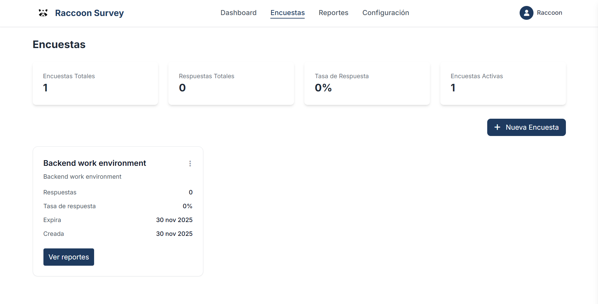
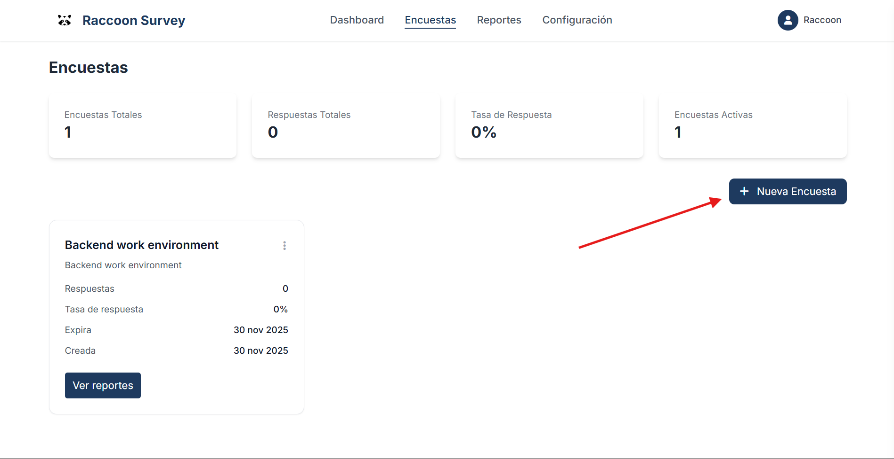
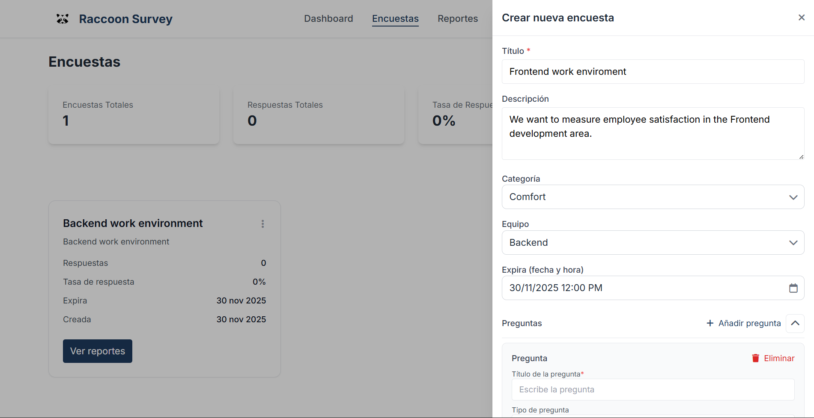
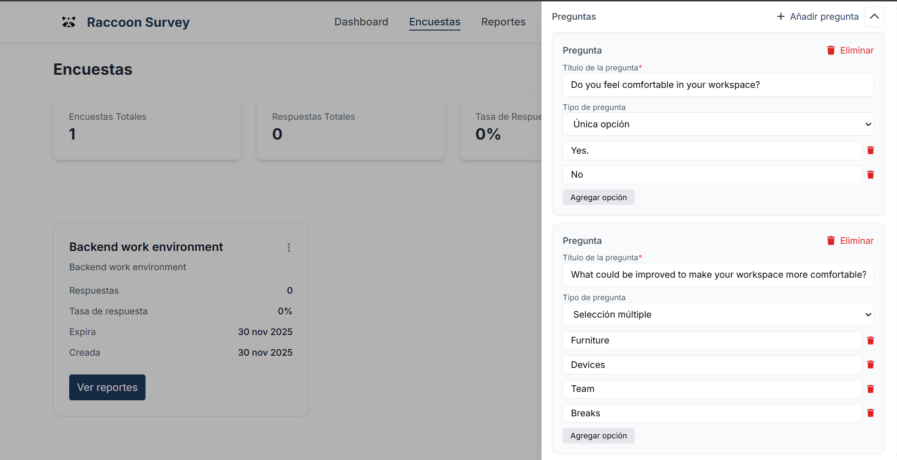
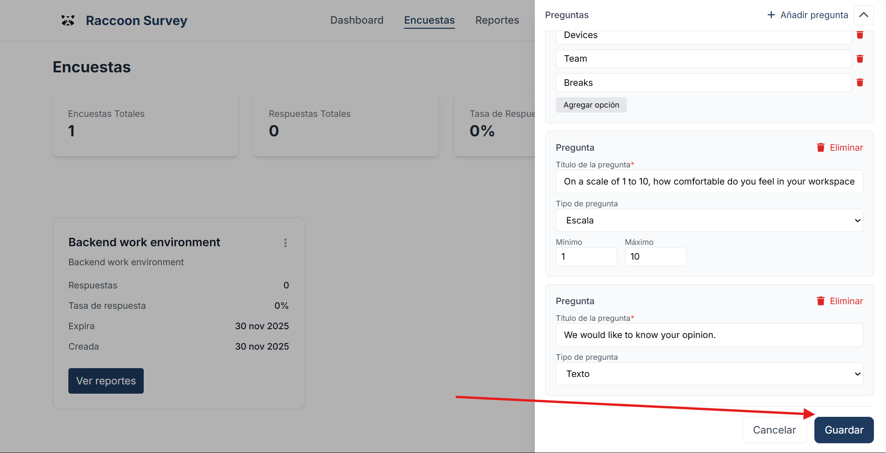
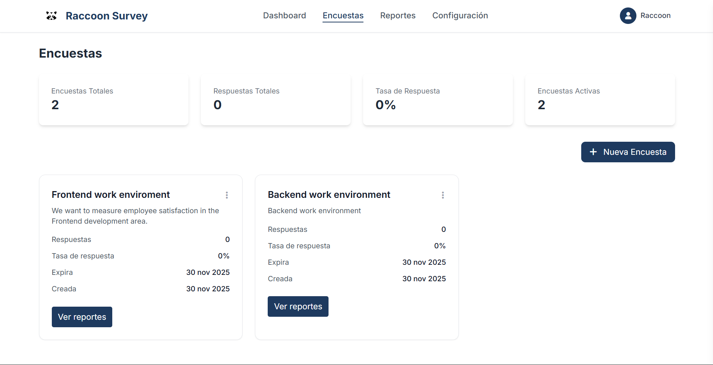
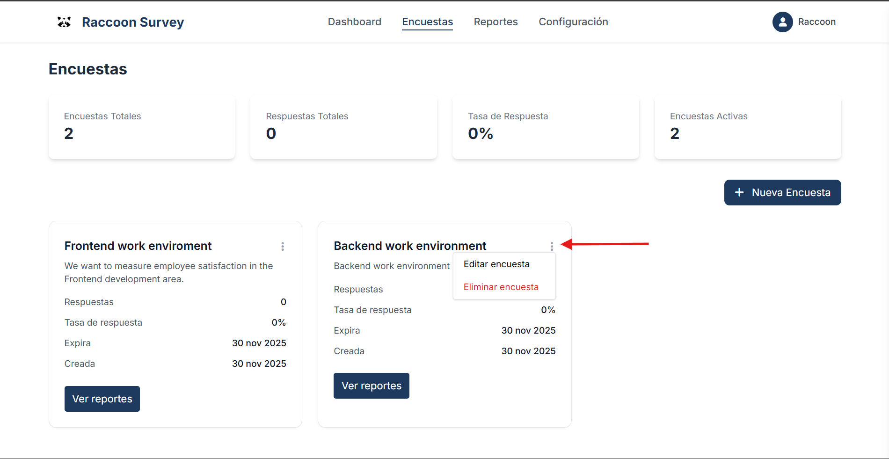

Create Surveys
==============

Learn how to create a new survey, define categories, and configure questions. This section shows the workflow from the main panel through to publication.

Prerequisites
-------------

- You are signed in.
- You have permissions to create surveys (role with privileges).

Steps
-----

1. In the main menu, select "Encuestas → Nueva encuesta".
2. Define the title, description, and validity dates.  
3. Add categories and questions (type, options, required).  
4. Create the questions for the survey.  
5. Save the survey.

Illustrations
-------------

Step 1 — Go to the Surveys page.
-----

Step 2 — Click the new survey button.
-----

Step 3 — Fill in the modal with the survey details.
-----

Step 4 — Create the questions for the survey.
-----

You can choose from different question types:

- Single choice
- Multiple choice
- Open text
- Likert scale

Step 5 — Click the save button.
-----

Once saved, the survey is available to generate tokens and distribute them.
-----

You can edit or delete the survey at any time.

In the next section you will learn how to generate tokens and distribute them.
