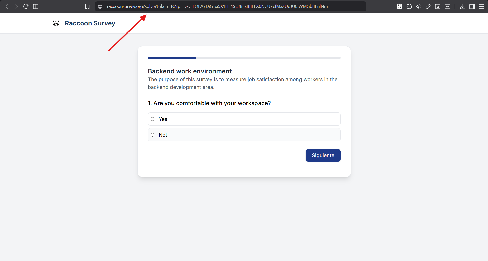
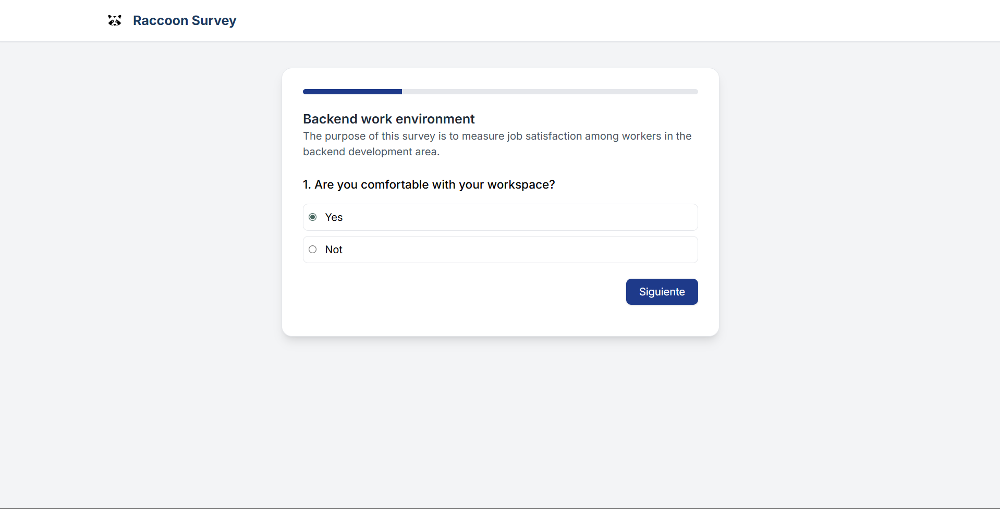
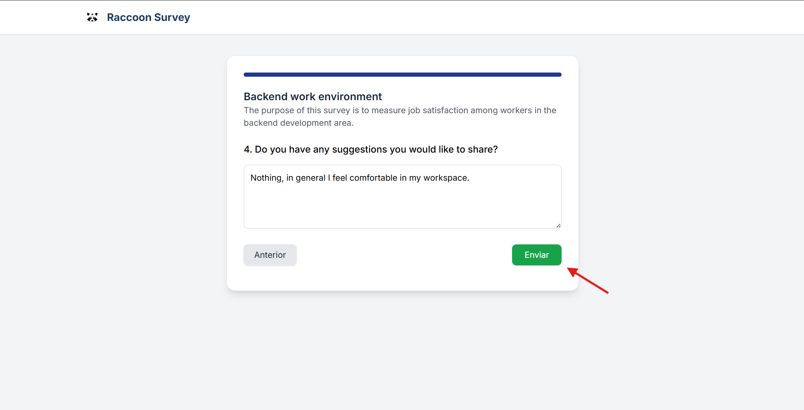
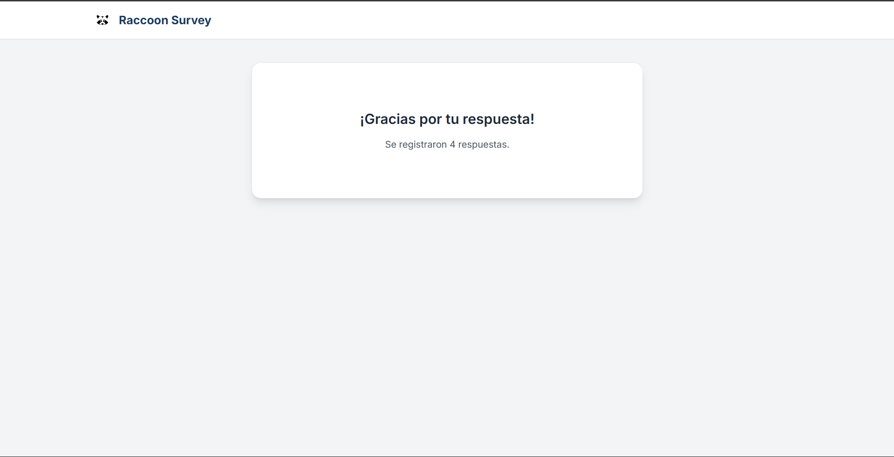

Token Distribution Guide
========================

Define how to securely share access tokens with participants, minimizing risk and ensuring traceability.

Prerequisites
-------------

- Have tokens generated and exported (CSV) from "Tokens → Export CSV".  
- Set an expiration date and decide if tokens are single-use or reusable.

Distribution Channels
---------------------

- Email: send individual links; avoid attaching the full CSV.  
- Messaging (Teams/Slack): share direct links only via DMs or private channels.  
- Printed QR codes: useful for in-person surveys; short expiry and single-use.

Secure Procedure
----------------

1. Generate tokens and download the CSV.  
2. Store the file in a secure, access-restricted repository.  
3. Distribute individual links, not the full CSV.  
4. Protect emails with encryption/shared key if needed.  

Usage Overview
--------------

After distributing tokens, make sure participants receive the correct and unique link, avoiding duplicates.
Users should follow this procedure:

1. Receive the link through the chosen distribution channel.
2. Click the link to access the survey.
3. Answer the survey questions.
4. Submit the survey.

Illustrations
-------------

Step 1 — Access via the survey token URL
-----

Step 2 — Answer the survey questions
-----

Step 3 — Submit the survey
-----

Step 4 — Finish
-----

After collecting all survey responses, you can generate reports and metrics from the results.

