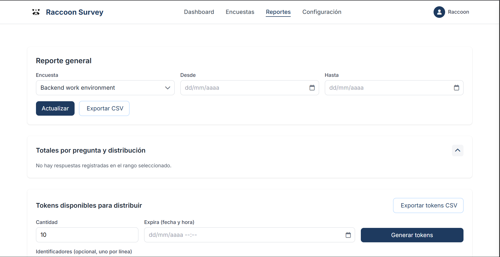
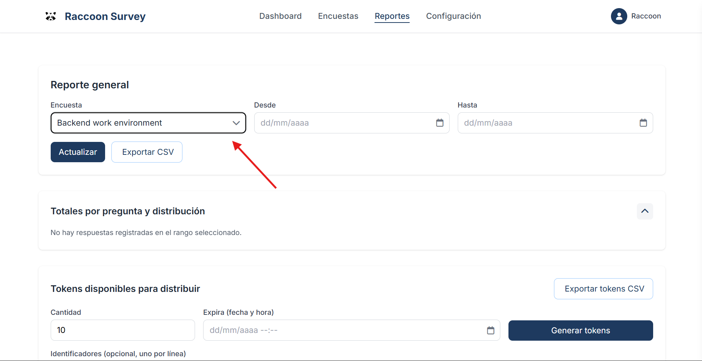
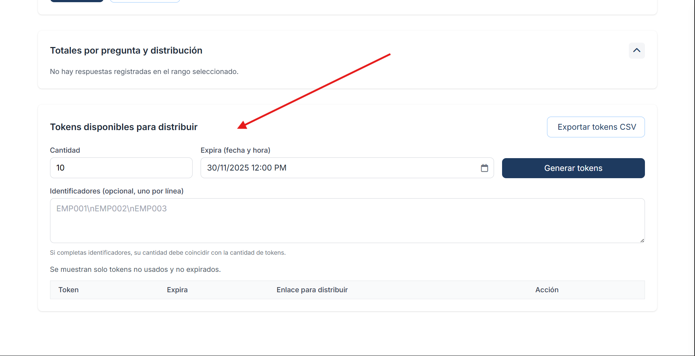
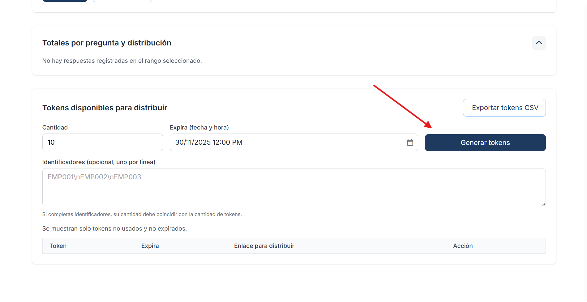
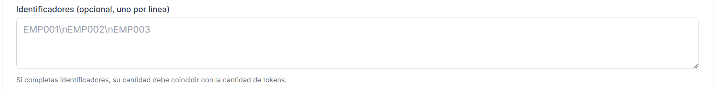
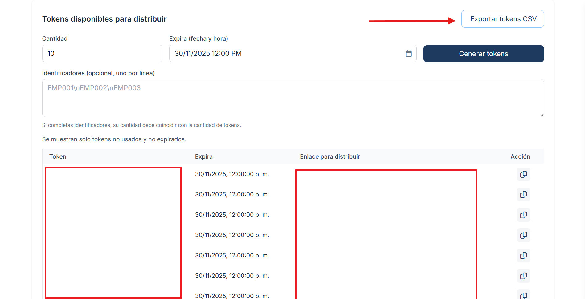
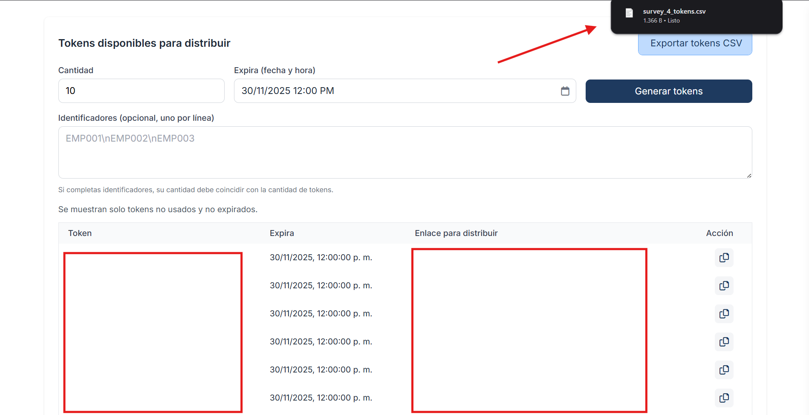

Generating access tokens
========================

Tokens allow participants to access a survey anonymously or authenticated, depending on your configuration.

Prerequisites
-------------

- Have a survey published or ready to publish.  
- Permissions to generate tokens.

Steps
-----

1. Go to 'Surveys → [Your survey] → Tokens'.  
2. Set expiration date and single-use if applicable.  
3. Generate and export (CSV) for distribution.  
4. Share the official link with participants.

Illustrations.
----------------------------

Step 1 — Go to the Reports page.
-----

Step 2 — Select a survey to generate tokens for.
-----

Step 3 — Choose the quantity and expiration date for the tokens.
-----

Step 4 — Generate the tokens.
-----

Optionally, you can add an "Identifier" or a "Name" for each generated token.

Step 5 — Export the tokens through a CSV file.
-----

Best practices
--------------

- Keep tokens in a secure location and restrict access to the exported file.  
- Use short expiration for sensitive campaigns.  
- Use unique identifiers for each token.
