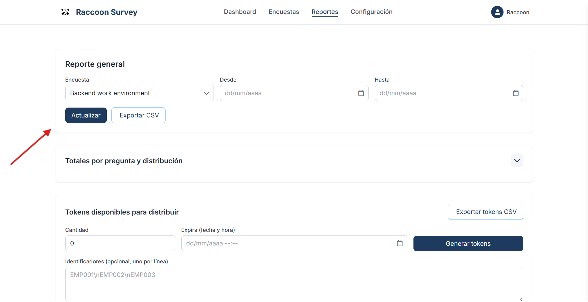
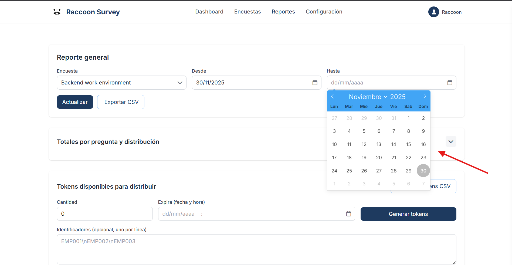
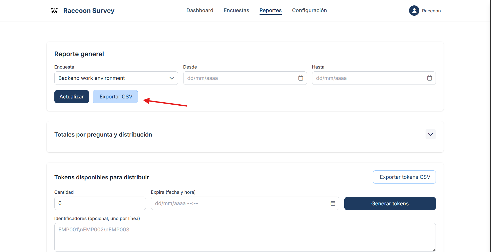
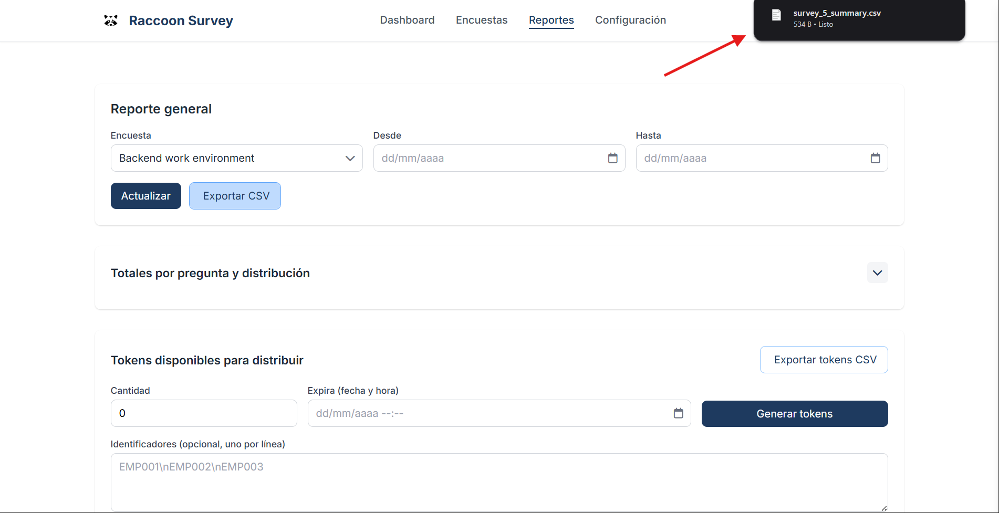

Reports and Metrics
===================

Explore reports, metrics, and exports to analyze your survey results.

Prerequisites
-------------

- Surveys with recorded responses.

Steps
-----

1. Go to "Reports → [Your survey]".  
2. Select the date range and filters.  
3. Review charts and tables; use CSV export.  
4. Share the report with stakeholders.

Illustrations
-------------

Step 1 — Choose the survey for which you want to generate reports
-----

Step 2 — Filter reports by date range (optional)
-----

Step 3 — Click the "Export CSV" button
-----

Step 4 — Download the CSV file
-----

Related Chapters
----------------

.. toctree::
   :maxdepth: 2

   survey_metrics
